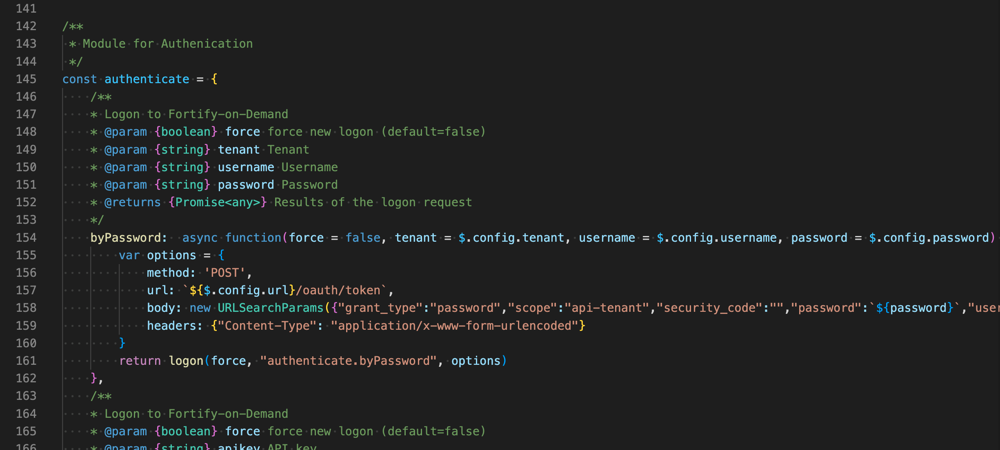
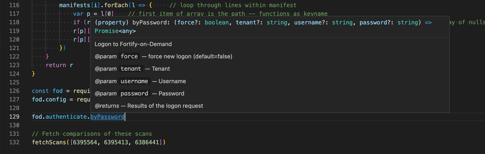

# FOD-Compare
Demonstrates how to use the Fortify-on-Demand REST API to compare multiple scans against one another, both the scan meta-data and the source code manifests.

Two language examples are provided:

1. JavaScript using Node.js - [fod.js](fod.js)
2. Python - [fod.py](fod.py)

The script will output both a json file ([differences.json](differences.json)) and excel ([differences.xlsx](differences.xlsx)).  

The JavaScript version uses Promises and async execution to fetch multiple REST calls simultaneous with very fast performance. 

----------
## Configuration

Examples in this project use a `.config.json` file to store the configuration.  If not present after cloning, simply make a file named `.config.json` and paste one of the following stubs:

```javascript
// if using an API key and secret
{
    "debug": true,
    "url": "https://api.ams.fortify.com",
    "apikey": "*******-****-****-****-*************",
    "secret": "*******************************************",
}

// if using a password
{
    "debug": true,
    "url": "https://api.ams.fortify.com",
    "username": "********",
    "password": "****************",
    "tenant": "tenantnamehere"
}
```


----------
## Basic Python Usage

The Python code is completely self-contained and easily readable.  Begin by editing the list of requisite ScanId's in your [fod.py](fod.py) file -- `fetchScans` def.

```python
# Fetch comparisons of these scans
fetchScans([6395564, 6395413, 6386441])
```
Once set, run the file with the command from a Terminal window:

```console
username@hostname FoD-Compare % python3 fod.py
```

You may need to install several Python modules on your system:
```python
import json
import requests
import csv
import xlwt
```

Use pip to install:
```console
python3 -m pip install json
python3 -m pip install requests
python3 -m pip install csv
python3 -m pip install xlwt
```


----------
## Basic JavaScript Usage

 The JavaScript example is more code lines, but demonstrates how to encapsulate the functionality into a CommonJS module that can be included in other scripts (require):

```javascript
const fod = require("./fod-api.js");    //include CommonJS module+
fod.config = require("./.config.json")  ///load the configuration from JSON (be sure to edit for your settings)
```


The [fod-api.js](fod-api.js) module uses JSDoc to support intellisense.  Example of JSDoc markup:

> 


Modern IDE's (my example uses Visual Studio Code) can recognize this markup to provide Intellisense and Autocompletion:

> 


Similar to the Python imports, you may need to install certain node mudules to run successfully.  
```javascript

var xl = require('excel4node');     // Excel builder

...

this._request = require("request");
if ($.config.proxy.length > 0) this.agent = new require('https-proxy-agent')($.config.proxy);

...

  "dependencies": {
    "excel4node": "^1.8.1",
    "https-proxy-agent": "^2.2.4",
    "request": "^2.88.0"
  }
}

```
A [package.json](package.json) enumerates the required dependencies and they may be fetched using NPM:
```console
npm update
```

Editing the list of requisite ScanId's in your [fod.js](fod.js) file -- `fetchScans` function.

```javascript
// Fetch comparisons of these scans
fetchScans([6395564, 6395413, 6386441])
```

Once set, run the file with the command from a Terminal window:

```console
username@hostname FoD-Compare % node fod.js
```
